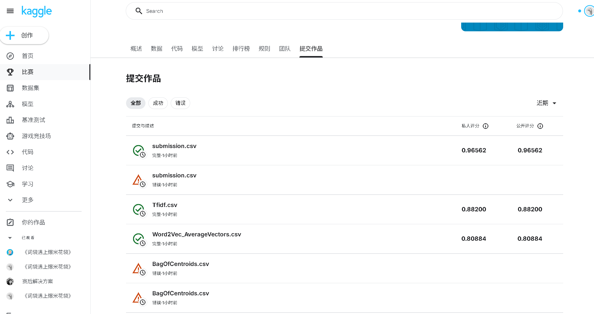

# 机器学习实验：基于 Word2Vec 的情感预测

## 1. 学生信息

- **姓名**：刘康
- **学号**：112304260126
- **班级**：数据1231

> 注意：姓名和学号必须填写，否则本次实验提交无效。

***

## 2. 实验任务

本实验基于给定文本数据，使用 **Word2Vec 将文本转为向量特征**，再结合 **分类模型** 完成情感预测任务，并将结果提交到 Kaggle 平台进行评分。

本实验重点包括：

- 文本预处理
- Word2Vec 词向量训练或加载
- 句子向量表示
- 分类模型训练
- Kaggle 结果提交与分析

***

## 3. 比赛与提交信息

- **比赛名称**：Bag of Words Meets Bags of Popcorn
- **比赛链接**：<https://www.kaggle.com/competitions/word2vec-nlp-tutorial>
- **提交日期**：2026/4/15
- **GitHub 仓库地址**：<https://github.com/spikelk/sentiment-analysis-bag-of-words>
- **GitHub README 地址**：<https://github.com/spikelk/sentiment-analysis-bag-of-words/readme.md>

> 注意：GitHub 仓库首页或 README 页面中，必须能看到“姓名 + 学号”，否则无效。

***

## 4. Kaggle 成绩

请填写你最终提交到 Kaggle 的结果：

- **Public Score**：0.96562
- **Private Score**（如有）：
- **排名**（如能看到可填写）：

***

## 5. Kaggle 截图

请在下方插入 Kaggle 提交结果截图，要求能清楚看到分数信息。

<br />



<br />

> 建议将截图保存在 `images` 文件夹中。\
> 截图文件名示例：`2023123456_张三_kaggle_score.png`

***

## 6. 实验方法说明

### （1）文本预处理

请说明你对文本做了哪些处理，例如：

- 分词
- 去停用词
- 去除标点或特殊符号
- 转小写

**我的做法：**
1. **去除HTML标签**：使用BeautifulSoup库去除文本中的HTML标签，只保留纯文本内容
2. **去除非字母字符**：使用正则表达式将非字母字符替换为空格
3. **转小写**：将所有文本转换为小写形式
4. **分词**：使用空格作为分隔符进行分词
5. **去停用词**：使用NLTK库的英文停用词列表去除常见的停用词

---

### （2）Word2Vec 特征表示

请说明你如何使用 Word2Vec，例如：

- 是自己训练 Word2Vec，还是使用已有模型
- 词向量维度是多少
- 句子向量如何得到（平均、加权平均、池化等）

**我的做法：**
1. **自己训练Word2Vec模型**：使用gensim库的Word2Vec类，基于训练数据和无标签数据进行训练
2. **词向量维度**：设置为100维
3. **句子向量生成**：
   - 方法一：将句子中所有词的词向量进行平均，得到句子向量
   - 方法二：使用K-means聚类算法将词向量聚类，然后统计每个句子中每个聚类的词频，得到质心袋特征

---

### （3）分类模型

请说明你使用了什么分类模型，例如：

- Logistic Regression
- Random Forest
- SVM
- XGBoost

并说明最终采用了哪一个模型。

**我的做法：**
1. **模型类型**：
   - 随机森林（Random Forest）：在Word2Vec特征上使用
   - 逻辑回归（Logistic Regression）：在TF-IDF特征上使用
   - NB-SVM风格逻辑回归：结合了朴素贝叶斯的思想，对特征进行加权后再使用逻辑回归

2. **最终采用的模型**：
   - 对于TF-IDF特征：使用普通逻辑回归和NB-SVM风格逻辑回归的融合模型，权重各为0.5
   - 对于Word2Vec特征：使用随机森林模型

---

## 7. 实验流程

请简要说明你的实验流程。

示例：

1. 读取训练集和测试集  
2. 对文本进行预处理  
3. 训练或加载 Word2Vec 模型  
4. 将每条文本表示为句向量  
5. 用训练集训练分类器  
6. 在测试集上预测结果  
7. 生成 submission 文件并提交 Kaggle  

**我的实验流程：**
1. **数据读取**：读取labeledTrainData.tsv和testData.tsv文件
2. **文本预处理**：对所有评论进行HTML标签去除、非字母字符替换、小写转换、分词和停用词去除
3. **特征构建**：
   - 构建TF-IDF特征（词级和字符级）
   - 训练Word2Vec模型并生成句子向量
4. **模型训练**：
   - 使用7折交叉验证训练模型
   - 在完整训练集上训练最终模型
5. **预测与提交**：
   - 在测试集上进行预测
   - 生成submission.csv文件并提交到Kaggle

---

## 8. 文件说明

请说明仓库中各文件或文件夹的作用。

示例：

- `data/`：存放数据文件
- `src/`：存放源代码
- `notebooks/`：存放实验 notebook
- `images/`：存放 README 中使用的图片
- `submission/`：存放提交文件

**我的项目结构：**

```text
project/
├─ main.py      # 使用TF-IDF特征和逻辑回归的实现
├─ labeledTrainData.tsv  # 带标签的训练数据
├─ testData.tsv         # 测试数据
├─ unlabeledTrainData.tsv  # 无标签的训练数据（用于Word2Vec训练）
├─ submission.csv      # 生成的提交文件
├─ 112304260126_刘康_kaggle_score.png      # Kaggle 提交结果截图
├─ .gitignore          # Git忽略文件配置
└─ readme.md           # 项目说明文档

```

